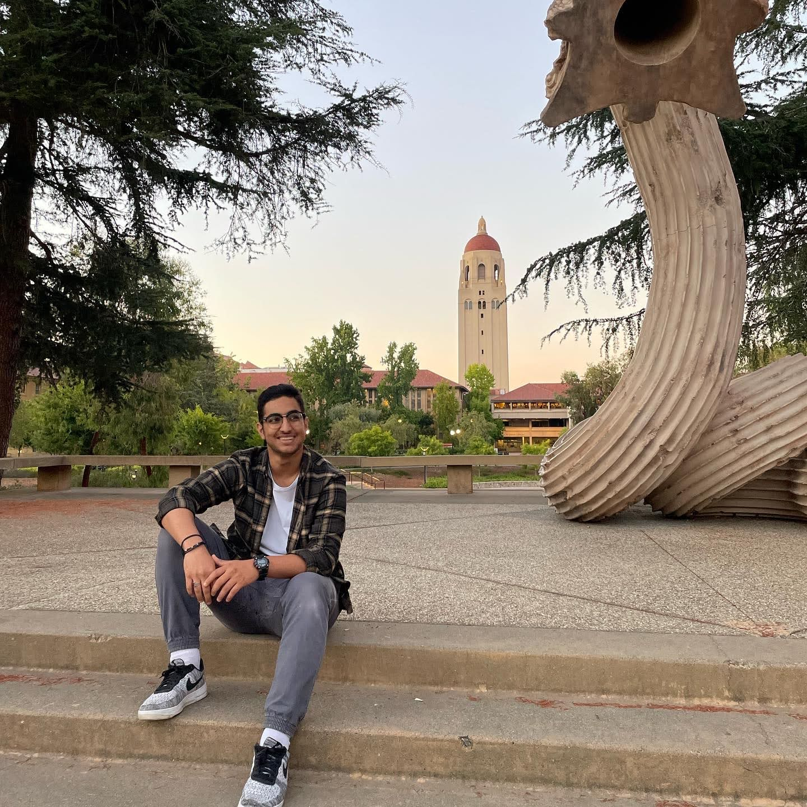
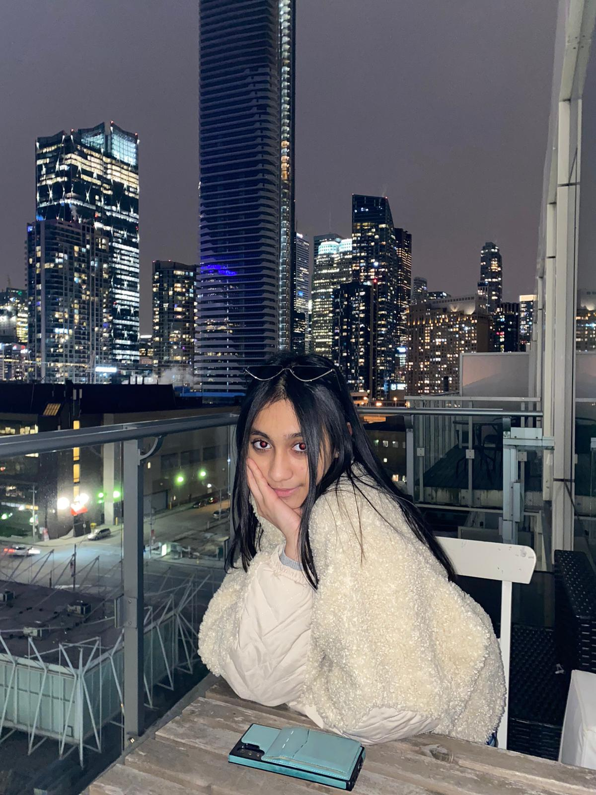
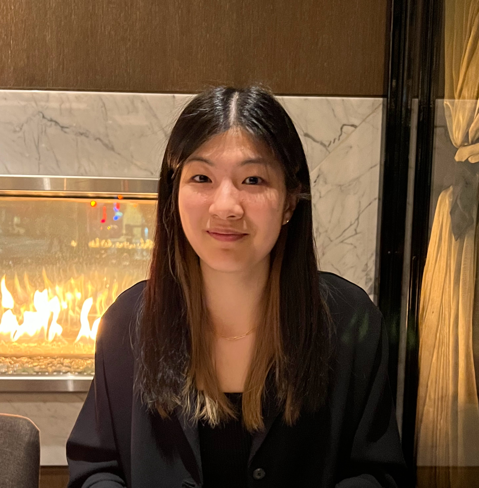
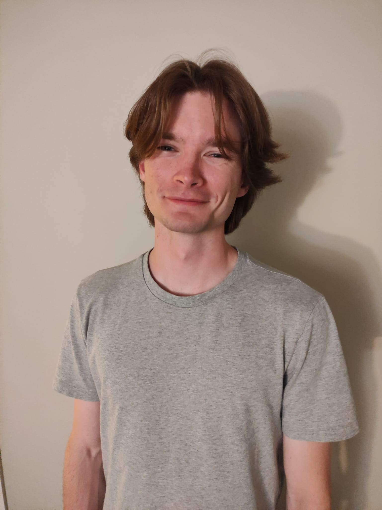
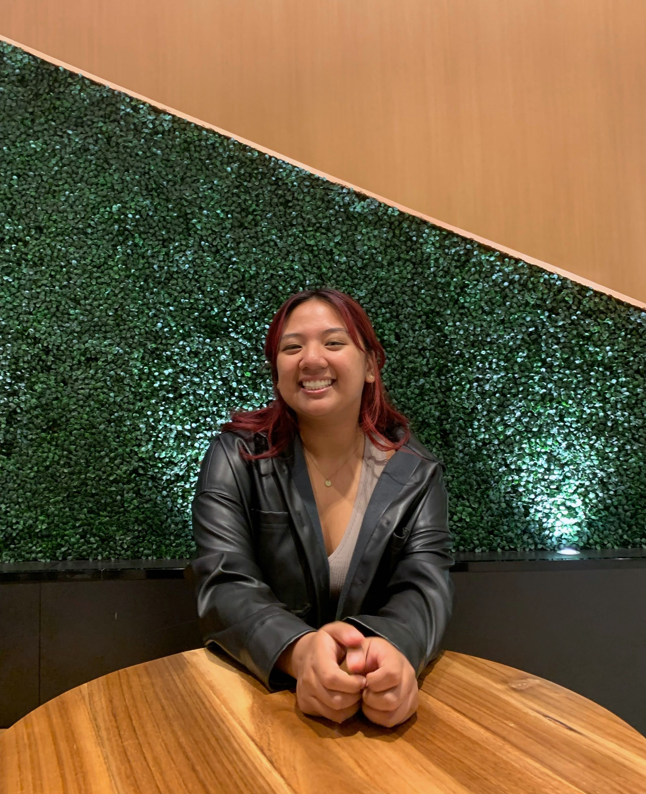

# Open Problem Bank in Statistics

## Project Team Members

| Name         | GitHub handle                      |
|--------------|------------------------------------|
| Firas Moosvi | [firasm](http://github.com/firasm) |

## Bios

### Principal Investigators

 </img>

#### **Dr. Firas Moosvi**

Firas Moosvi is a Lecturer at UBC Okanagan in the Computer Science, Math, Physics, and Statistics department.
He teaches courses in Physics, Data Science, and Computer Science at the undergraduate and graduate levels.
He has many research interests and they fall under three main umbrellas: medical imaging for applications in cancer, scholarship of teaching and learning (SoTL), and learning analytics.
Most recently, he is looking at how the field of learning analytics can provide insight to surface and reduce inequities in STEM programs.
Firas has a deep appreciation for data visualization, active learning, and open source projects.   

 </img>

#### **Dr. Jake Bobowski**

Jake is a Professor of Teaching in physics at UBC Okanagan.
In addition to teaching and Physics Education Research, he is interested in applying microwave techniques to study condensed matter systems.      

### Undergraduate students

 </img>

#### **Ava Cornell**

I am a fourth year honours physics student at UBC Okanagan. Throughout my degree, I have thoroughly enjoyed being a physics teaching assistant and tutor, which has caused me to develop an interest in making learning more accessible and less stressful for students. In my free time, I like to hike, camp, and socialize.    

 </img>

#### **Abby Kiehlbauch**

I am a first year Bachelor of Arts student at UBCO planning to major in Computer Science. As it is my first year I don't have a specific area of interest, however my passions have always been mental health advocacy and social justice - I hope to find a way in which Computer Science can elevate those two fields. I am looking forward to further exploring the field of Computer Science in my next three years at UBCO. While I'm not studying or spending my days on Zoom I am usually reading, sewing, crocheting, or baking! 

#### **Gavin Kendal-Freedman**
 </img>
I just completed my second year enrolled in UBC Okanagan’s chemistry program, with a minor in data science. I’m very interested in helping making learning more accessible to others, as I have seen firsthand and through others how much mandatory textbooks and teaching tools can cost on top of tuition, and how much that can hamper learning, so helping more free quality education resources be available is an exciting opportunity for me to be a part of and lend my experience with python to this project! Further, across all the coding classes I have taken, the lack of smart, computer graded testing of code using easily available technology has always surprised me, so being able to help create a solution to this gap in educational resources is an exciting opportunity!

Outside of classes and education, I enjoy playing the trombone (and euphonium sometimes), as well as playing D&D 5e, and coding in python, anything from small automation scripts to larger projects, including data visualization. Also being from the pacific northwest, I love hiking and nature, as well mountains, especially Mt. St. Helens, Mt. Baker, and Mt. Rainer.

#### **Borna**
 </img>

My name is Borna, just completed my 2nd year studying business and computer science at UBC Vancouver. Aside from this project I'm also on the Investment team at Front Row Ventures, and hoping to go into product management, starting with an internship next Summer! Excited to work on this project, developing a large open problem bank with helpful feedback for questions that for me at least is very critical to my learning, while developing a variety of skills in this process. Besides work/school, I'm a big sports fan, especially Soccer and Basketball, and I also have my 2nd degree black belt in Taekwondo, you might also catch my playing story or online games with friends. Looking forward to working with everyone! 

#### **Ruwaida**
 </img>

I'm going into my third year majoring in Data Science & Economics! In my first year, I was able to work with a synthetic data generation startup over the summer and currently I am a student connector & transition specialist on campus! With my interdisciplinary career interest, I am excited to contribute to this project in the technical capacity needed to understand how we can make direct impact on learning platforms while developing my technical skills and growing! Being a part of Dr Moosvi's classes since my first year, I have had the privilege of being able to access the resources available to exercise active learning and I am excited to be able to expand on that student experience for incoming students. 
As for my personal life, I am creatively invested in visual arts and reading and love rugby! 

 

#### **Theresa**
 </img>

I just finished my second year at UBC Vancouver, where I'm currently pursuing a combined major in Computer Science and Microbiology and Immunology. I’m passionate about healthcare and software, hence my major, and am super excited to be part of a project that will have a positive impact on students’ lives. In my free time, you’ll likely find me playing ultimate frisbee, snowboarding, or trying new restaurants (I’m a big foodie) but I also love art and design, and gaming too!

 

#### **Aidan**
 </img>

Aidan is a recent graduate of UBCO, majoring in Computer Science, having a keen interest in programming and a strong foundation in Python.
He has completed an 8-month project for the Rotary Club of Kelowna - Ogopogo, designing and implementing features according to project requirements, demonstrating his ability to write clean and efficient code. Beyond this he is particularly interested in the intersection of computer science and education, and has worked as a teaching assistant creating resources for undergraduate level Computer Science courses.
As an Undergraduate Research Assistant, Aidan is eager to contribute to ongoing research projects in computer science, both independently and as part of a team.

  

#### **Bella**
 </img>
I am an incoming third year computer science student at UBCO! I'm excited to be part of a project that focuses on the betterment of students and learning while giving me an opportunity to grow my own technical skills. I can't wait to expand on the open education resources that I used in my first year! When I'm not studying, I love doing anything around art and design!

   

### Graduate students

 </img>

#### **Michael Kudla**

I am a PhD student in MedPhys. I am developing a patient specific technology suite for low cost imaging and surgical tool manufacturing (3D printed) for treatment of gynecological malignancies. I am into rock climbing and ski-touring.    

