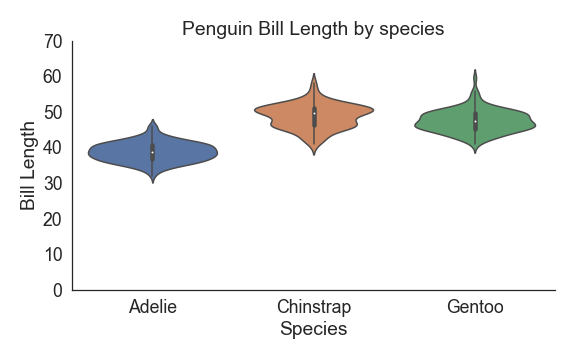

# {{ params_vars_title }}
In this quiz we will be looking at exploring the `penguins` dataset.


## Part 1

You can load the `penguins` dataset in `seaborn` using:

```
df = sns.load_dataset("penguins")
```

This dataset contains information about three species of penguins (Adelie, Gentoo, and Chinstrap), and various
characteristics including their bill_length, bill_depth, flipper_length, body_mass, and sex.


Credit: Artwork by [@allison_horst](https://www.allisonhorst.com).

Which of the following claims can you make from **only** the violin plot below:



### Answer Section

- {{ params_part1_ans1_value }}
- {{ params_part1_ans2_value }}
- {{ params_part1_ans3_value }}
- {{ params_part1_ans4_value }}
- {{ params_part1_ans5_value }}

## Attribution

Problem is licensed under the [CC-BY-NC-SA 4.0 license](https://creativecommons.org/licenses/by-nc-sa/4.0/).<br> 